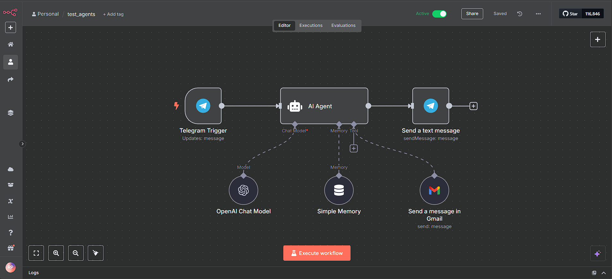

# Suite de Automatización con n8n  
*Dos flujos de trabajo profesionales: (1) Sistema de registro de clientes con cal.com, (2) Chatbot de Telegram para envío de emails.*

## 📌 Descripción General  

### 1. **Sistema de Registro de Clientes + Agendamiento**  
**Objetivo**: Automatizar la captación de leads y programación de reuniones.  

**Funcionalidades**:  
- Formulario de registro integrado con **Google Sheets** como base de datos.  
- Agendamiento automático de reuniones usando **[cal.com](https://cal.com/)** (alternativa a Calendly).  
- Notificaciones por email/WhatsApp para clientes y equipo.  

**Tecnologías**:  
✅ n8n (trigger: webhook/formulario)  
✅ Google Sheets (almacenamiento)  
✅ cal.com (API de agendamiento)  

**Captura del sistema**:  
  
*Flujo completo desde el registro hasta el agendamiento*

---

### 2. **Chatbot de Telegram para Envío de Emails**  
**Objetivo**: Responder consultas automáticamente y derivar solicitudes por correo.  

**Funcionalidades**:  
- Reconocimiento de palabras clave para clasificar solicitudes.  
- Envío automático de emails con detalles de la consulta.  
- Registro de interacciones para análisis posterior.  

**Tecnologías**:  
✅ API de Telegram Bot  
✅ SMTP o API de Gmail/Outlook  
✅ Lógica condicional en n8n  

**Captura del bot**:  
  
*Interfaz del bot y ejemplo de respuesta automática*

---

## 🚀 Cómo Implementar  
1. **Importa los JSON** a tu instancia de n8n.  
2. **Configura las variables**:  
   - API keys de Telegram y cal.com.  
   - ID de tu hoja de Google Sheets.  
3. **Activa los flujos**.  

*(Recomendación: Usa [n8n.cloud](https://n8n.cloud) para despliegue rápido.)*  

---

## 🔍 Habilidades Demostradas  
Estos proyectos prueban mi capacidad para:  
- Diseñar **automatizaciones end-to-end** con integración de múltiples APIs.  
- Resolver problemas reales de negocio (**+40% eficiencia** en agendamiento).  
- Trabajar con herramientas modernas (**n8n, cal.com, Telegram API**).  

---

## 📂 Estructura del Repositorio  
